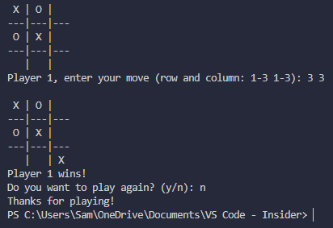

# Tic Tac Toe in C

A simple console-based Tic Tac Toe game written in C.  
Two players can take turns entering their moves, and the game checks for wins, draws, and invalid inputs.

## Features

✅ 2-player mode (Player 1 = `X`, Player 2 = `O`)  
✅ Input validation (no cheating!)  
✅ Detects wins (rows, columns, diagonals)  
✅ Detects draw  
✅ Option to play again

## How to Compile

You can compile the program using `gcc`:

``bash
gcc tic_tac_toe.c -o tictactoe

How to Run
Run the compiled program:
./tictactoe

Example: 

License:
Feel free to use, modify, and share 💖
